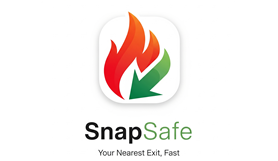
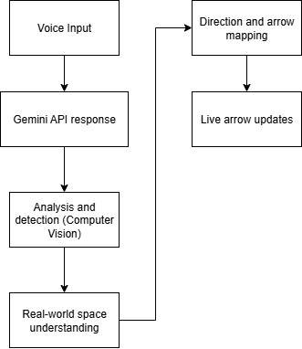

# SnapSafe - Hack the North 2025

  

SnapSafe is an augmented-reality (AR) navigation system aimed to help people with vision-impairments navigate exits in the case of a fire. Powered by Gemini API, the user simply asks for the nearest fire exit, at which point SnapSafe locates and overlays directional cues to the nearest visible fire-exit using Snap Spectacles.

A short gif of SnapSafe can be found below. Be sure to checkout the [Devpost](https://devpost.com/software/pathsafe-dv3taf) and the full [Demo Video](https://www.youtube.com/watch?v=ajmASxcm4OA)!

## How It Works
Below is simple flowchart demonstrating the code logic.

  

## Features Currently In-Progress
- Obstacle detection and navigating around them to exits
- World-query-hit to detect ground vs. higher-level surfaces (obstacles), and warn users with a green vs. red highlighting on-screen
- Voice AI Feedback and haptic feedback
